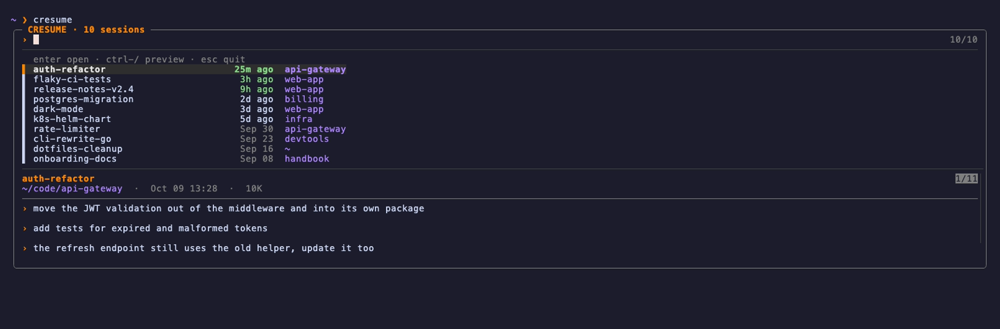
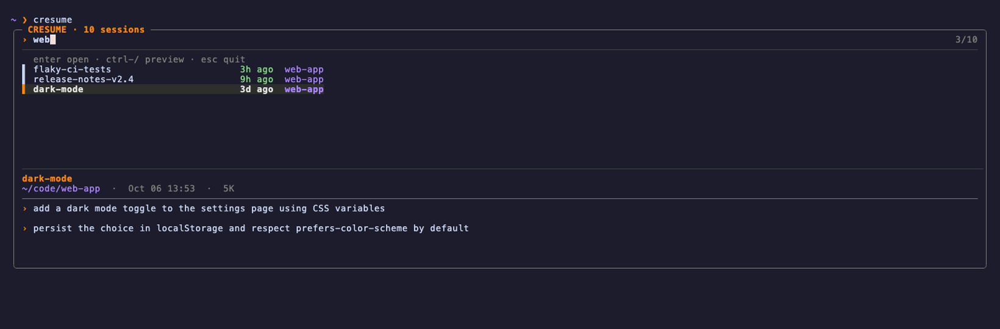

# cresume

An fzf picker for resuming **named** [Claude Code](https://claude.com/claude-code) sessions from any directory.

Named sessions are the ones you started with `claude -n <name>` or renamed with `/rename`. `cresume` finds them across every project, lets you fuzzy-pick one with a preview of its recent prompts, then `cd`s into that session's working directory and runs `claude -r <id>`.


## Requirements

- zsh
- [fzf](https://github.com/junegunn/fzf) 0.40+
- [jq](https://jqlang.github.io/jq/)
- [ripgrep](https://github.com/BurntSushi/ripgrep) (optional, strongly recommended: startup drops from seconds to well under one with large transcript histories)

```sh
brew install fzf jq ripgrep
```

## Install

```sh
git clone https://github.com/joshillian/cresume.git ~/code/cresume
echo 'source ~/code/cresume/cresume.plugin.zsh' >> ~/.zshrc
```

Plugin managers that load `*.plugin.zsh` (antidote, zinit, oh-my-zsh custom plugins) work too.

## Usage

| Command | Does |
| --- | --- |
| `cresume` | Pick from all named sessions |
| `cresume <name>` | Exact name match opens directly (newest wins); otherwise opens the picker pre-filtered to `<name>`, auto-selecting a single match |



In the picker: type to filter, `enter` to open, `ctrl-/` to toggle the preview, `esc` to quit.



The list shows each session once (newest wins when names repeat), with its age (green within 24h) and working directory. The preview shows the directory, last-modified time, transcript size and the last 8 prompts you typed.

## Config

| Variable | Default | |
| --- | --- | --- |
| `CRESUME_CMD` | `claude` | Command used to resume, e.g. `claude --dangerously-skip-permissions` |

## How it works

Claude Code stores transcripts at `~/.claude/projects/<project>/<session-id>.jsonl`. A session's name is the last `custom-title` record in its transcript, and its working directory is the first `cwd` field. `cresume` reads those with `rg` (or `grep`) and `jq`; nothing is written.

## Demo

The screenshots above use fake sessions. To regenerate them, install [vhs](https://github.com/charmbracelet/vhs) and run `vhs demo/demo.tape` from the repo root; `demo/seed.py` builds a throwaway `$HOME` so no real transcripts are recorded.
